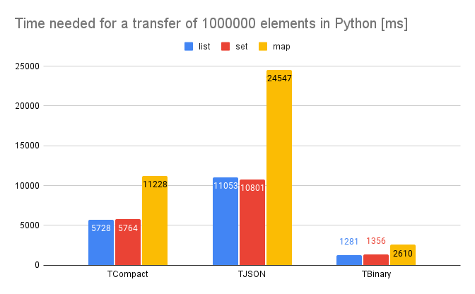

# Thrift
Homework

## Task description
The aim of the task is to create a simple client-server application and to conduct experiments comparing 
the performance (execution time) and communication efficiency (number of bytes at the L3 level) of the serialization 
methods offered by Thrift for several (three) qualitatively different data structures and data sizes (i.e. 
sequence with a length of 1 and 100 elements) and for different programming languages. It is worth answering the
question: what are the negative sides of using serialization that offers greater communication efficiency (if any)?

## Solution description
To investigate the different serialization methods offered by Thrift (TBinary,
TJSON and TCompact), two analogous client-server applications in Java and
Python. As part of the tests, clients sent 1,000,000 items stored in
different data structures (list, set, map) and measured the time it took to transfer this data to
server.  

For a smaller number of elements, the difference between data structures and languages was
insignificant, but the greater difference was shown by the greater number of elements.
The number of bytes transferred for each protocol was also checked (in
[MemoryTest](src/main/java/xenoteo/com/github/MemoryTest.java) class).

## Results
*You can see a small [report](Statystyki.pdf) in Polish.*  
  
  
  
  

The presented test results show that the TCompact protocol consumes the least
memory, that is, it is the most effective. The TJSON protocol is the least effective. While
the most efficient (i.e. the least time-consuming) protocol is TBinary. The TJSON protocol is 
the least efficient.  

As expected, the map transfer time in each case took almost
twice as long as for lists and sets. It is related to the fact that the map
holds twice as many elements (1,000,000 key-value pairs). Comparing sets and
list, we can see that in Python their transfer time is almost the same, but in the case of
Java transfer lists took less time with each protocol.  

We also see that for each data structure and for each protocol, there is Java
much more efficient than Python.  

The data transfer efficiency (i.e. the number of bytes transferred) in both languages was the same.  

In conclusion, it can be seen that the most effective solution is slightly less
efficient, and the most efficient solution is slightly less effective. Choosing
specific protocol, we must take into account what is most important to us -
less memory consumption, less time consumption or perhaps the readability of the messages being sent?
Only one protocol will be better suited for each case; there is no such
protocol that would be absolutely better or absolutely worse, because each of them is
good for various uses.

## Requirements
`pip install thrift`

## Execution
The main files are [ThriftClient.java](src/main/java/xenoteo/com/github/client/ThriftClient.java) & 
[ThriftServer](src/main/java/xenoteo/com/github/server/ThriftServer.java) 
and [thrift_client.py](src/main/py/thrift_client.py) & [thrift_server.py](src/main/py/thrift_server.py). Memory tests
can be run using [MemoryTest.java](src/main/java/xenoteo/com/github/MemoryTest.java).
  
If you use Intellij, right click on folder `gen-java` -> `Mark Directory as` -> `Generated Sources Root`.   
  
If you use IntelliJ and there are dependencies that are not seen go to `File` -> `Invalidate Caches / Restart...`.  
  
The easiest way to run Python scripts in Intellij is using `Run/Debug Configurations` and specifying the Python
interpreter there.  
  
To use [Python in Intellij](https://www.jetbrains.com/help/idea/plugin-overview.html#90e61d91),
configure [Python SDK](https://www.jetbrains.com/help/idea/configuring-python-sdk.html)
(e.g. [a system interpreter](https://www.jetbrains.com/help/idea/configuring-local-python-interpreters.html)).

## Code generation
From the content root folder:  
`thrift -r --gen java transfer.thrift`  
`thrift -r --gen py -out src/main/py/gen_py transfer.thrift`

## Helpful resources
- https://thrift.apache.org/
- https://thrift.apache.org/tutorial/py.html
- https://thrift.apache.org/tutorial/java.html

