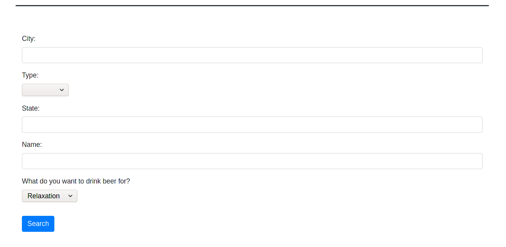

# REST API
Homework

## Brewery API - about
This is a simple web app making request to two external APIs - [Open Brewery DB](https://www.openbrewerydb.org/)
and to [The Bored API](https://www.boredapi.com/). In the first request gathered information about breweries
suitable to the provided filtering parameters (see a screen below). A user can search breweries by country, state, city,
type and/or name. If no special parameters provided then all breweries from the database are returned. The second 
request finds an activity which can be performed while drinking bear. To make this request users should choose
what they want to drink bear for (relaxation, education, cooking and so on). After a request is made, a user is 
redirected to the result page, where all suitable breweries are listed and one chosen activity is shown. Additionally,
there are statistics about top 3 words in names of breweries provided.

## Execution
To run the application, run the following command in the project root folder:  
`mvn spring-boot:run`  
After that, the app is available at http://localhost:8080.

## Technologies used
- Java + Spring Boot
- Thymeleaf + Bootstrap
- Maven
